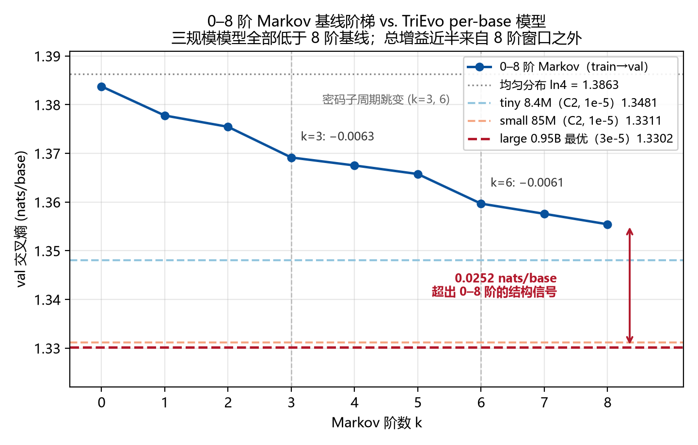

# TriEvo: A DNA Language Model Pretrained from Scratch on Viral Genomes

[简体中文（主版）](README.md) | English

> An independent, from-scratch pretraining study: corpus construction, a 5-scheme tokenizer study, model implementation, and a **52-run controlled experiment campaign** across three model scales (8.4M → 0.95B) — built following the methodology of Stanford CS336 (Assignments 1–2).

**One-line summary**: On a 425 Mbp viral genome corpus, parameter scaling saturates at ~85M parameters (an 11× scale-up improves val loss by only 0.0002 nats/new-base); the best per-base model (1.330) **beats every measured 0–8 order Markov baseline** (ladder 1.384 → 1.355), with roughly half its gain coming from structure beyond 8th-order statistics; and the 6×-compression 6-mer tokenizer converges to a context-free 6-mer marginal predictor — extracting **zero** of the cross-token signal (≥0.25 nats/token) that demonstrably exists.

---

## 1. What & Why (Motivation)

Genome foundation models (DNABERT-2, Nucleotide Transformer, HyenaDNA, Evo) all face two design questions that are usually answered by intuition rather than controlled experiments:

1. **How should DNA be tokenized?** Per-base (no compression, highest resolution), k-mer (fixed compression, larger vocab), or learned BPE? Compression buys context length — but what does it *cost* in learnable signal?
2. **Does scaling parameters help at small-corpus scale?** Viral genomes are abundant (RefSeq holds ~20k complete genomes) but tiny compared to web text. Where is the parameter–data balance point?

TriEvo answers both with a leakage-free corpus and a controlled, cohort-structured experiment campaign — deliberately small enough to be run and understood by one person, but rigorous enough that every claim traces to a specific run.

## 2. Data

| Stage | Detail |
|---|---|
| Source | NCBI RefSeq viral genomes: **19,575** complete genomes |
| Deduplication | BLAST all-vs-all, **95% ANI** clustering → **17,339** representative genomes |
| Corpus size | ~425 Mbp; **339,868,143** training tokens (per-base tokenization) |
| Split | **Genome-level** 8:1:1 train/val/test — clustering *before* splitting, so no homolog of a test genome appears in training |
| Augmentation | Reverse-complement (RC) expansion (used in the large-scale runs) |
| Storage | uint16 pre-tokenized arrays; EOS concatenation + random-start fixed-length window sampling; context length 2,048 (4,096 also evaluated) |

## 3. Method & Tech Stack

**Tokenizer study** — 5 schemes under identical model configurations:

| Scheme | Vocab | Stride | Compression |
|---|---:|---|---|
| per-base | 8 | 1 | none (1 token / base) |
| 3-mer | 68 | 1 | none (1 token / base) |
| 6-mer | 4,100 | 1 / 2 / 6 | 1× / 2× / 6× |

**Architecture** — decoder-only Transformer, implemented from scratch (no framework-generated model code):

- RoPE positional encoding; RMSNorm (pre-norm); SwiGLU FFN (3 matrices)
- No bias terms; untied embeddings; standard multi-head attention
- Context length 2,048

| Config | d_model | d_ff | Layers | Heads | Params |
|---|---:|---:|---:|---:|---:|
| tiny | 256 | 1,024 | 8 | 8 | 8.4M |
| small | 768 | 2,048 | 12 | 12 | 85M |
| large | 1,280 | 5,120 | 36 | 20 | ≈0.95B |

**Hand-written training stack**:

- AdamW, cosine LR schedule, gradient clipping, mixed precision; multi-GPU DDP
- **Triton FlashAttention-2 (forward + backward)**, fp32 accumulation, validated against the reference implementation (numerical error < 1e-2, fp16 standard tolerance)
- Trained on a heterogeneous cluster (V100-32GB / L40S-46GB / H200-143GB); large runs on 4×GPU DDP; throughput 215k / 100k / 14k tokens/s at tiny / small / large scale

**Triton FA2 system benchmark** (single RTX 4090, torch 2.3.1; 3 dtypes × 4 head_dims × 5 seq lens; PyTorch SDPA backends forced and verified via profiler):

- vs naive attention (bf16): **5–36× faster at long sequences** (16k), speedup growing with sequence length — consistent with IO-complexity theory
- vs SDPA mem-efficient backend: consistently faster for d ≤ 32 (+1.1–2.7×) and at d=128 long sequences (+1.5×)
- vs official FlashAttention-2 kernel: **1.1–1.2× faster at d∈{16,64}, seq=4096; 1.3–2.8× slower at d≥32 long sequences**, with the gap attributed to pipeline depth (num_stages) and tiling — a known, bounded optimization gap
- fp16 and bf16 measurements agree pointwise within ±2% (internal reproducibility check)
- Resolved a d=128 shared-memory overflow by hand-computing the SMEM budget (96/99 KB) and pruning autotune configs by head_dim

## 4. Experimental Protocol

**52 runs with training data**, organized into cohorts so that comparisons are only made *within* a controlled protocol:

| Cohort | Protocol | Runs | Question answered |
|---|---|---:|---|
| C1a | ctx2048, bs32, lr 3e-4, no RC, fixed 6000 steps | 15 | Dataset intervention (full vs 95%-ANI-reduced) |
| C1b | ctx256, bs64 | 5 | Context-length intervention |
| C2 | lr 1e-5, RC, reduced data, bs8, early-stop | 15 | **Three-point scaling curve** (the only cross-scale controlled cohort) |
| C3 | large only: 5 tokenizers × 4 LRs | 20 | **Tokenizer × LR sensitivity grid** |
| C4 | RC on/off paired (small, 6-mer s6) | 2 | RC augmentation intervention |

**Unified metric**: per-token losses are not comparable across tokenizers with different strides/vocabularies. All cross-tokenizer comparisons use **nats/new-base = best_val_loss ÷ stride** (≈ bits-per-base ÷ ln 2), against two baselines:

- Uniform-distribution baseline: ln(vocab) per token (1.386 / 4.159 / 8.318 nats)
- **Base-frequency null model: 1.3838 nats/base (measured)** — unigram fit on train, cross-entropy on val (`design/markov_baseline/`; the previous 1.370 was a theoretical estimate, now obsolete). *Gain* = 1.3838 − nats/new-base — the signal extracted beyond base composition alone.
- **0–8 order Markov ladder (measured)**: 1.3838 → 1.3554 nats/base (fit on train, evaluated on val, with backoff) — the total upper bound of local-statistics signal.

**Red line**: cross-cohort loss differences are reported but never used as evidence (batch size, LR, stopping rule, and RC change simultaneously across cohorts).

## 5. Results

*Figures below use Chinese axis labels; the numbers are as reported here.*

### 5.1 Parameter scaling saturates — the bottleneck is data, not model size


Within the controlled C2 cohort (identical protocol across scales), per-base validation loss:

| | tiny 8.4M | small 85M | large ≈0.95B |
|---|---:|---:|---:|
| nats/new-base | 1.3481 | **1.3311** | **1.3309** |
| tokens consumed to best | 16.7M | 23.6M | 94.4M |
| epoch fraction | 0.05 | 0.07 | 0.28 |

Three mutually reinforcing pieces of evidence:

1. **11× parameters (85M → 0.95B) bought 0.0002 nats/new-base** — while 8.4M → 85M bought 0.017. The curve is flat, not slowly declining.
2. **It is not undertraining**: the 0.95B model consumed 4× more tokens than 85M to reach *the same* loss, and all large runs across 4 learning rates hit their best point and then rose (early-stop triggered by overfitting, not budget truncation).
3. **Chinchilla consistency**: with D = 340M unique tokens, the compute-optimal parameter count ≈ D/20 ≈ **17M**. tiny (8.4M) sits below optimum; small exceeds it 5×; large exceeds it 56×. Flat scaling above 85M is exactly what data-constrained scaling theory predicts.

Total signal extracted over the measured frequency null model: **≈ 0.0536 nats/base (~3.9% of 1.3838)** — exhausted by ~85M parameters; about half of it (0.0252) lies beyond the 0–8 order Markov ladder (see 5.6).

### 5.2 The stride-6 tokenizer converges to a context-free 6-mer marginal predictor


Across **all 20 large runs (4 learning rates)**, 6-mer stride-6 validation loss stays within **8.233–8.244** — an extreme range of only 0.010 across learning rates.

The mechanism, step by step:

1. At stride 1, adjacent 6-mer tokens share 5/6 bases, so next-token prediction degenerates to "copy 5 known bases + predict 1 new base" — the same difficulty as per-base (tiny 6-mer s=1 reaches 1.42, near this floor).
2. Stride 6 removes the overlap: each token now contains 6 genuinely unknown bases. The theoretical landing point of a context-free predictor is the **6-mer block marginal**, which by chain-rule decomposition equals the sum of 0–5 order Markov cross-entropies: **8.240** nats/token (1.3838+1.3778+1.3755+1.3692+1.3675+1.3658).
3. The measured 8.233–8.244 brackets 8.240 (±0.007) — the model learned **all within-token structure** (0.06 below 6 × unigram = 8.303: dinucleotide through 5th-order window statistics) but **zero cross-token structure**.

**Interpretation**: the 6× compression bought 12,288 bp of effective context (2,048 tokens), and cross-token signal demonstrably exists (the per-base model beats the 8-order Markov by 0.025 nats/base, i.e. ≥0.25 nats/token) — yet stride-6 extracts **0%** of it: the 6-bases-at-once prediction task exhausted the model's capacity, and long-range dependencies were never learned. The context was paid for in full and never used. (Boundary: Evo at 7B params / ~100× data shows big tokenizers can work at larger budgets; this finding is scoped to ≤0.95B params / 340M tokens.)

### 5.3 Tokenizer rankings are a function of learning rate


The large-scale LR sweep (C3) reveals a three-way interaction:

- **per-base is LR-robust** at 0.95B: 1.3302–1.3500 across all 4 LRs (range 0.02), best at 3e-5
- **3-mer is LR-sensitive**: 1.3422 (1e-5) → 1.5198 (3e-4), range 0.18
- **6-mer family fails at all 4 LRs** (≥ 6.77)

At tiny scale the ordering **reverses**: 3e-4 is better for *every* tokenizer (per-base 1.322 vs 1.348). **Any tokenizer comparison run at a single fixed LR measures that LR's ranking, not the tokenizer's** — a methodological caveat for tokenizer studies generally, including published ones.

### 5.4 Data interventions


- **95% ANI deduplication (tiny @3e-4)**: per-base 1.332 → 1.322; 6-mer s=1 **1.872 → 1.421** with divergence eliminated (the only 6-mer run to complete all 6000 steps without collapsing). Data hygiene helps overlapping-vocabulary tokenizers most — but 6-mer s=2 *worsened* (1.536 → 1.920), so the effect does not generalize to all k-mer configs.
- **RC augmentation**: the only clean paired comparison (small, 6-mer s6) shows Δ = 0.0005 nats/base — **not interpretable**, because the landing point sits in the stride-6 collapsed regime. We report no controlled evidence for or against RC augmentation (a three-arm decoupled experiment — verbatim-repeat vs RC-vs-verbatim, Muennighoff-style — is designed in `design/rc_experiment/DESIGN.md` but not yet run).

### 5.5 An unresolved optimization anomaly, reported as such

6-mer s=1 and s=2 degrade monotonically with scale (s=1: 1.42 → 2.25 → 6.77), with gradient norms exploding across scales (max grad norm at lr 1e-5: tiny 1.8 → small 58 → large **1.9×10⁶**). We explicitly do **not** interpret this as "6-mer tokenization is worse at scale" — it is an unresolved mix of optimization instability, LR-scale mismatch, and budget shortage, and we flag it as an open item rather than fitting it into a narrative.

### 5.6 Model-quality verdict: the 0–8 order Markov ladder

Measured on the per-base packed streams (train 339.9M / val 41.7M tokens), fit on train → evaluated on val, with backoff (script & data in `design/markov_baseline/`):

| k | 0 | 1 | 2 | 3 | 4 | 5 | 6 | 7 | 8 |
|---|---:|---:|---:|---:|---:|---:|---:|---:|---:|
| CE (nats/base) | 1.3838 | 1.3778 | 1.3755 | 1.3692 | 1.3675 | 1.3658 | 1.3597 | 1.3576 | 1.3554 |



Three verdicts:

1. **The best per-base model (1.3302) beats every 0–8 order Markov baseline** — 0.0252 nats/base below the 8th-order (1.3554). The entire 0–8 order local-statistics signal is worth only 0.0284; the model's beyond-8th-order gain is nearly equal to it: **~47% of the total gain 0.0536 comes from structure outside 8th-order statistics** (k > 8 untested; "higher-order local" vs "truly long-range" is not distinguished).
2. **The model is the tightest entropy-rate upper bound in the project**: rate ≤ 1.3302 (model) < 1.3554 (8-order) < … < 1.3838 (unigram). The lower bound remains unknown — no "entropy-limited" claim is made.
3. **The ladder jumps at k=3 and k=6** (increments 0.0063 / 0.0061, ~3× other steps) — codon periodicity: the 3-periodic nucleotide usage of coding-dominated viral genomes is cleanly detected.

Also: train splits into 13,871 sequences = 17,339 × 0.8 ✓; val self-fit vs train→val differ by ≤ 0.005 per order — no distribution drift across the split. The Markov baselines are fit on forward-only train (models trained with RC augmentation), making them stronger, not weaker, on forward val — the model's lead is a conservative estimate.

## 6. Core Conclusions

1. **Parameter scaling saturates; the corpus is the constraint.** 8.4M → 85M → 0.95B yields 1.3481 → 1.3311 → 1.3309 nats/new-base under identical protocol; 11× scale-up buys 0.0002. Chinchilla-optimal for D = 340M is ~17M params.
2. **The best model beats every measured 0–8 order Markov baseline** (1.330 vs ladder 1.384 → 1.355), with ~half its gain (0.025 nats/base) beyond 8th-order statistics — the model learned real structure, not a memory of local statistics.
3. **Compression-only tokenizers (6-mer s=6) converge to a context-free 6-mer marginal predictor** at this budget: 8.233–8.244 nats/token ≈ the 0–5 order Markov sum 8.240, constant across 4 LRs; extracting **zero** of the cross-token signal (≥0.25 nats/token) that demonstrably exists — compression bought 12,288 bp of context that was never used.
4. **Tokenizer rankings are LR-dependent and scale-dependent** (per-base robust / 3-mer sensitive / 6-mer unstable at 0.95B; reversed ordering at 8.4M) — single-LR tokenizer comparisons are confounded.
5. **Data hygiene (ANI deduplication) mainly stabilizes overlapping-vocabulary tokenizers** (6-mer s=1: 1.872 → 1.421, divergence eliminated).
6. **A hand-written Triton FA2 reaches fused-kernel territory**: 5–36× over naive attention at long sequences; between the official flash and mem-efficient backends; gaps localized and attributed.

## 7. Limitations (stated plainly)

- **No downstream-task evaluation** is included in this release; conclusions are restricted to held-out language-modeling loss.
- The "parameter saturation" claim is strictly **"parameters cannot extract more signal from this corpus under a near-single-epoch budget"** — it is not a claim about irreducible entropy. The 0–8 order Markov ladder is now measured (5.6): all baselines are entropy-rate **upper bounds** (the model itself provides the tightest, 1.3302); the lower bound remains unknown, so no "entropy-limited" claim is made.
- All runs consumed **< 0.5 epoch**; hardware was heterogeneous (V100/L40S/H200) and some runs were interrupted by node preemption; the RC effect has **no controlled estimate**.
- Cross-cohort comparisons are reported but not interpreted, by design.

## 8. Repository & Reproducibility

Code release is in progress. The planned layout follows `configs/ src/ scripts/ tests/ results/`; the analysis artifacts referenced above are already in-repo:

```
design/unified_analysis/        # 52-run master table + 4 figures + full analysis (ANALYSIS.md)
design/experiment_summary/      # R1 loss tables (20 runs)
design/large_experiment_summary/# R2 large/small/tiny summaries (32 runs)
design/markov_baseline/         # 0–8 order Markov baseline (script + measured results + ladder figure)
design/rc_experiment/           # three-arm RC intervention design (not yet run)
benchmark_results/              # Triton FA2 benchmark suite (fp16/bf16/fp32) + summary
```

Every number in this README traces to `design/unified_analysis/master_experiments.csv`, `design/markov_baseline/markov_baseline_results.csv`, or `benchmark_results/benchmark_summary.md`.

## 9. Roadmap

- [x] Corpus construction & leakage-free split (17,339 genomes)
- [x] 5-scheme tokenizer study + nats/new-base normalization
- [x] tiny (8.4M) / small (85M) / large (0.95B) training — 52 runs
- [x] Triton FA2 + system benchmark (3 dtypes × 4 head_dims × 5 seq lens)
- [ ] Three-arm RC augmentation experiment (designed, `design/rc_experiment/DESIGN.md`)
- [x] Higher-order Markov baseline (0–8 orders, measured 2026-09; `design/markov_baseline/`)
- [ ] Markov ladder extension beyond k=8 (separating higher-order local vs truly long-range structure)
- [ ] Code release & downstream-task evaluation

## Acknowledgments

The training-stack design follows the methodology of [Stanford CS336 (Language Modeling from Scratch)](https://stanford-cs336.github.io/) Assignments 1–2, implemented independently.

## Contact

Jiang Wei — [GitHub](https://github.com/weijiang34) · wjiang34-c@my.cityu.edu.hk
